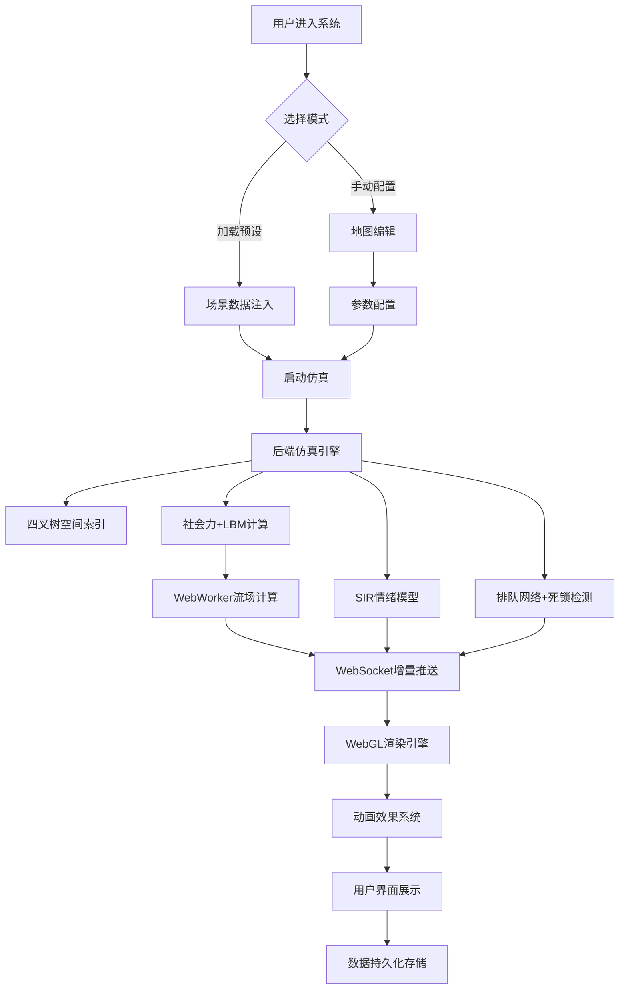

## 1. 产品概述

咖啡馆排队热力剧场是一个融合多阶段排队网络、社会力流体动力学与情绪传染模型的全栈Web仿真沙盘系统。通过宏观-微观双重仿真，用户可直观观察咖啡馆排队服务系统从宏观流场到微观个体行为的完整动态变化过程。

- 核心目标：构建高真实度的咖啡馆排队服务仿真系统，支持教学演示、科研验证与运营优化分析
- 目标用户：运筹学研究者、服务运营管理者、系统动力学教学人员
- 市场价值：填补国内多Agent仿真与流体动力学交叉领域可视化工具的空白

## 2. 核心功能

### 2.1 用户角色

| 角色 | 注册方式 | 核心权限 |
|------|----------|----------|
| 普通用户 | 无需注册 | 地图编辑、参数配置、仿真运行、场景加载、数据导出 |

### 2.2 功能模块

1. **主仿真界面**：2D地图画布、实时Agent渲染、流场可视化、情绪热力图叠加
2. **地图编辑器**：吧台、座位区、出入口、障碍物绘制与编辑
3. **参数配置面板**：排队拓扑、到达模型、员工系统、行人动力学参数配置
4. **预设场景系统**：四个经典场景一键加载
5. **数据持久化**：SQLite数据库存储完整工程数据
6. **异常可视化**：五种边界情况的专门展示模块

### 2.3 页面详情

| 页面名称 | 模块名称 | 功能描述 |
|----------|----------|----------|
| 主界面 | 仿真画布 | WebGL渲染2D地图、Agent、流场、热力图的综合视图 |
| 主界面 | 控制面板 | 开始/暂停/重置仿真、速度调节、时间显示 |
| 主界面 | 左侧工具栏 | 地图编辑工具（绘制、选择、删除、缩放） |
| 主界面 | 右侧参数面板 | 多维度参数配置、实时数据统计 |
| 主界面 | 底部场景栏 | 四个预设场景快速切换按钮 |
| 主界面 | 异常展示区 | 边界情况可视化切换与状态指示 |

## 3. 核心流程

用户进入系统后，可选择加载预设场景或手动编辑地图与参数。启动仿真后，后端通过时间步进与离散事件混合驱动计算，WebSocket推送增量状态至前端，前端通过WebWorker并行计算LBM流场与核密度估计，最终在WebGL画布上呈现所有动态效果。

## 4. 用户界面设计

### 4.1 设计风格

- **主色调**：深邃咖啡棕（#3E2723）作为背景基调，搭配暖橙色（#FF6D00）作为强调色，冷蓝色（#00B8D4）用于流场可视化
- **按钮风格**：圆角矩形，微玻璃拟态效果，hover时有轻微上浮与发光
- **字体**：标题使用'Playfair Display'衬线字体体现剧场感，正文使用'JetBrains Mono'等宽字体保证数据可读性
- **布局风格**：三栏式布局，左侧工具栏、中央仿真画布、右侧参数面板，底部场景栏
- **图标**：使用lucide-react图标库，配合轻微旋转与缩放动画

### 4.2 页面设计概述

| 页面名称 | 模块名称 | UI元素 |
|----------|----------|--------|
| 主界面 | 仿真画布 | 深色背景、网格纹理、粒子涡流、情绪色彩扩散、Agent动画 |
| 主界面 | 左侧工具栏 | 垂直图标按钮、工具状态高亮、快捷键提示 |
| 主界面 | 右侧参数面板 | 可折叠分组、滑块控件、数值输入、实时数据波形图 |
| 主界面 | 底部场景栏 | 四个场景卡片、hover缩放效果、加载进度条 |
| 主界面 | 异常指示器 | 右上角状态徽章、颜色编码（绿/黄/红）、异常详情弹窗 |

### 4.3 响应式设计

- 桌面端优先（≥1440px）：三栏完整布局
- 平板端（1024-1439px）：右侧面板可收起为抽屉
- 移动端（<1024px）：单列布局，工具栏转为顶部导航，参数面板转为底部抽屉

### 4.4 动画设计要点

- 流场粒子：遵循LBM速度场的涡旋运动，尾部拖尾效果
- 情绪热力图：从冷蓝到炽红的平滑色彩过渡，脉冲扩散波纹
- 群组Agent：聚拢时的弹性收缩、分裂时的弹性拉伸形变
- 员工疲劳：操作延迟时订单票的抛物线变慢且颤抖
- 拼桌确认：座位处的环形波纹扩散效果
