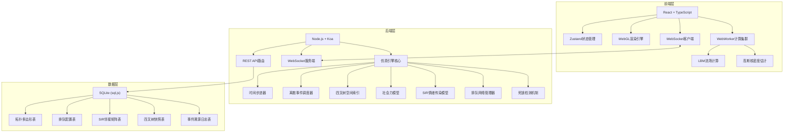
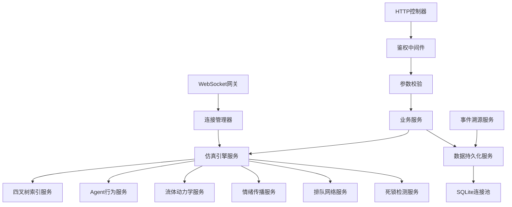
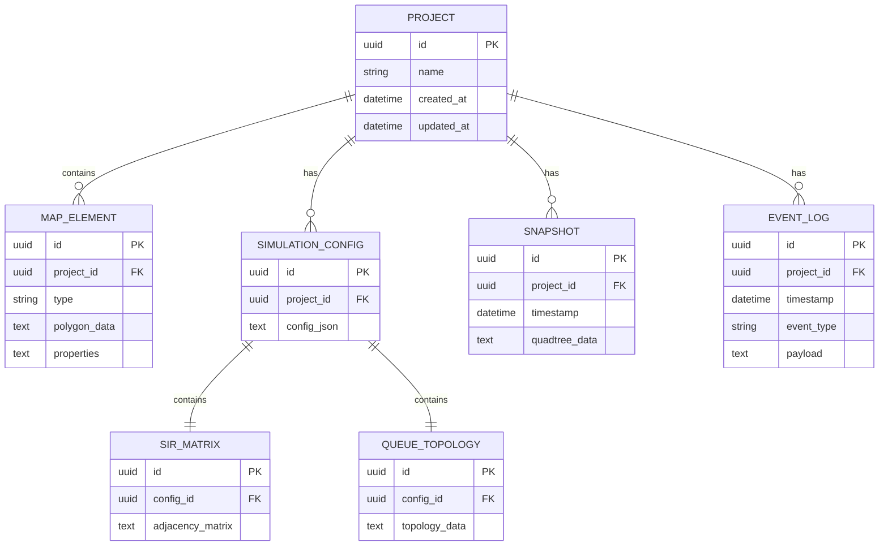

## 1. 架构设计



## 2. 技术描述

- **前端**：React@18 + TypeScript@5 + Vite@5 + TailwindCSS@3 + Zustand@4 + Three.js@0.160
- **并行计算**：WebWorker API + Comlink
- **图形渲染**：WebGL2 + 自定义着色器
- **后端**：Node.js@20 + Koa@2 + TypeScript@5 + ws@8
- **数据库**：sql.js@1.10（SQLite WASM版本）
- **通信协议**：WebSocket + 增量状态差分编码
- **构建工具**：Vite@5 + tsup

## 3. 路由定义

| 路由 | 方法 | 用途 |
|------|------|------|
| /api/projects | GET | 获取所有仿真工程列表 |
| /api/projects | POST | 创建新仿真工程 |
| /api/projects/:id | GET | 获取单个工程详情 |
| /api/projects/:id | PUT | 更新工程配置 |
| /api/projects/:id | DELETE | 删除工程 |
| /api/presets | GET | 获取所有预设场景 |
| /api/presets/:id | GET | 加载指定预设场景 |
| /api/simulation/:id/snapshot | POST | 保存四叉树快照 |
| /api/simulation/:id/events | GET | 获取事件溯源日志 |
| /ws | WS | WebSocket实时通信端点 |

## 4. API类型定义

```typescript
// 核心类型定义
interface Point { x: number; y: number; }

interface MapElement {
  id: string;
  type: 'bar' | 'seat' | 'entrance' | 'obstacle';
  polygon: Point[];
  properties: Record<string, any>;
}

interface Agent {
  id: string;
  position: Point;
  velocity: Point;
  target: Point;
  state: 'queuing' | 'ordering' | 'waiting' | 'seating' | 'leaving';
  emotion: 'S' | 'I' | 'R';
  groupId?: string;
  frustration: number;
}

interface Employee {
  id: string;
  position: Point;
  skillMatrix: number[];
  fatigue: number;
  efficiency: number;
}

interface SimulationConfig {
  queuingTopology: {
    orderQueue: { servers: number; capacity: number };
    pickupQueue: { servers: number; capacity: number };
    roamingQueue: { capacity: number };
  };
  arrivalModel: {
    lambda: number;
    groupSizeDistribution: number[];
  };
  socialForce: {
    A: number; B: number; k: number; kappa: number;
  };
  lbmParams: {
    relaxationTime: number;
    initialDensity: number;
  };
  sirParams: {
    beta: number; gamma: number;
    infectionRadius: number;
  };
}

interface SimulationState {
  time: number;
  agents: Agent[];
  employees: Employee[];
  queues: { name: string; length: number }[];
  flowField: number[][][];
  heatMap: number[][];
  deadlockDetected: boolean;
  anomalyFlags: string[];
}
```

## 5. 服务器架构



## 6. 数据模型

### 6.1 ER图



### 6.2 DDL语句

```sql
CREATE TABLE projects (
  id TEXT PRIMARY KEY,
  name TEXT NOT NULL,
  created_at DATETIME DEFAULT CURRENT_TIMESTAMP,
  updated_at DATETIME DEFAULT CURRENT_TIMESTAMP
);

CREATE TABLE map_elements (
  id TEXT PRIMARY KEY,
  project_id TEXT NOT NULL REFERENCES projects(id),
  type TEXT NOT NULL CHECK (type IN ('bar', 'seat', 'entrance', 'obstacle')),
  polygon_data TEXT NOT NULL,
  properties TEXT DEFAULT '{}'
);

CREATE TABLE simulation_configs (
  id TEXT PRIMARY KEY,
  project_id TEXT NOT NULL REFERENCES projects(id),
  config_json TEXT NOT NULL
);

CREATE TABLE sir_matrices (
  id TEXT PRIMARY KEY,
  config_id TEXT NOT NULL REFERENCES simulation_configs(id),
  adjacency_matrix TEXT NOT NULL
);

CREATE TABLE queue_topologies (
  id TEXT PRIMARY KEY,
  config_id TEXT NOT NULL REFERENCES simulation_configs(id),
  topology_data TEXT NOT NULL
);

CREATE TABLE snapshots (
  id TEXT PRIMARY KEY,
  project_id TEXT NOT NULL REFERENCES projects(id),
  timestamp DATETIME DEFAULT CURRENT_TIMESTAMP,
  quadtree_data TEXT NOT NULL
);

CREATE TABLE event_logs (
  id TEXT PRIMARY KEY,
  project_id TEXT NOT NULL REFERENCES projects(id),
  timestamp DATETIME DEFAULT CURRENT_TIMESTAMP,
  event_type TEXT NOT NULL,
  payload TEXT DEFAULT '{}'
);

CREATE INDEX idx_map_elements_project ON map_elements(project_id);
CREATE INDEX idx_snapshots_project ON snapshots(project_id);
CREATE INDEX idx_event_logs_project ON event_logs(project_id);
CREATE INDEX idx_event_logs_type ON event_logs(event_type);
```
