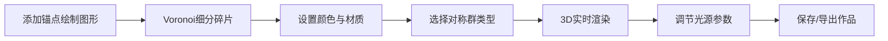

## 1. 产品概述

彩色玻璃万花筒工作台是一个基于计算几何与群论对称性的3D交互式可视化系统，允许用户设计、编辑并实时渲染精美的彩色玻璃万花筒图案。

- 面向数字艺术家、设计师和数学爱好者，提供沉浸式的几何艺术创作体验
- 融合传统万花筒美学与现代计算几何算法，创造独特的视觉艺术作品

## 2. 核心功能

### 2.1 用户角色

| 角色 | 注册方式 | 核心权限 |
|------|----------|----------|
| 创作者 | 无需注册，本地使用 | 设计玻璃碎片、调节参数、保存/加载工程、导出图像 |

### 2.2 功能模块

1. **主工作台**：2D设计画布 + 3D实时渲染视口的双屏布局
2. **参数控制面板**：对称群配置、光源调节、材质属性设置
3. **预设场景库**：四个精心设计的预设场景一键加载
4. **工程管理**：保存、加载、导出万花筒项目

### 2.3 页面详情

| 页面名称 | 模块名称 | 功能描述 |
|---------|----------|----------|
| 主工作台 | 2D设计画布 | 拖拽锚点绘制多边形玻璃碎片，Voronoi图自动细分 |
| 主工作台 | 3D渲染视口 | 实时展示万花筒效果，支持轨道控制视角 |
| 控制面板 | 对称群配置 | 选择二面体群/循环群，设置镜面夹角 |
| 控制面板 | 光源系统 | 调节光源角度、色温、强度 |
| 控制面板 | 材质编辑器 | 设置碎片颜色、透光率、折射率 |
| 预设区 | 场景预设 | 四个预设按钮快速加载经典场景 |
| 工具栏 | 工程管理 | 保存/加载SQLite工程文件，导出渲染图 |

## 3. 核心流程

用户在2D画布上添加锚点绘制基础图形 → 系统自动生成Voronoi玻璃碎片网格 → 用户为碎片设置颜色和材质 → 选择对称群类型和镜面夹角 → 3D视口实时渲染万花筒效果 → 调节光源观察光影变化 → 保存工程或导出图像。

## 4. 用户界面设计

### 4.1 设计风格

- **主色调**：深紫蓝 (#1a1a2e) 背景，彩色玻璃碎片采用高饱和度宝石色系
- **辅助色**：金色 (#d4af37) 边框和强调元素，营造教堂彩窗氛围
- **按钮风格**：圆角矩形，带轻微发光效果，悬停时有彩虹光晕动画
- **字体**：展示字体使用 Cinzel Decorative（古典艺术感），正文字体使用 Noto Sans SC
- **布局风格**：左右分栏布局，左侧为参数控制面板，中央为双屏画布+视口，底部为预设栏
- **图标风格**：线性几何图标，融入对称群和几何元素

### 4.2 页面设计概述

| 页面名称 | 模块名称 | UI元素 |
|---------|----------|--------|
| 主工作台 | 2D画布 | 深色网格背景，锚点可拖拽，Voronoi边界发光效果 |
| 主工作台 | 3D视口 | 暗黑色背景，玻璃半透明效果，光线折射光斑 |
| 控制面板 | 参数区 | 滑块带数值显示，下拉菜单用哥特式边框 |
| 预设区 | 按钮栏 | 四个彩色渐变按钮，悬停放大效果 |
| 状态栏 | 信息区 | 显示FPS、反射次数、当前对称群信息 |

### 4.3 响应性

- 桌面端优先，支持1920×1080及以上分辨率
- 宽屏适配：2560×1440时自动扩展参数面板宽度
- 画布区域自适应，保持正方形比例

### 4.4 3D场景指导

- **环境**：纯黑背景，突出彩色玻璃的透光效果，无HDRI
- **光照设置**：主光源模拟教堂天窗，带体积光效果；边缘光勾勒玻璃轮廓
- **相机设置**：初始正视图，支持轨道控制、缩放、平移
- **构图**：中心对称构图，万花筒图案占据视口中心
- **交互动画**：碎片翻转动画、焦散光斑游走、拓扑水波变化、齿轮咬合旋转、滤色混合
- **后期效果**：轻微 bloom 发光，色差模拟棱镜效果，颗粒感增加复古质感
- **性能预算**：目标帧率60fps，单帧三角形数控制在50万以内

## 5. 异常与边界情况处理

1. **非约数镜面夹角**：视觉上显示接缝撕裂效果，并在状态栏提示
2. **全反射次数超限**：自动降低反射深度，显示性能警告
3. **退化三角形**：自动检测并微扰锚点位置，避免渲染黑斑
4. **双曲几何性能**：在边界处采用LOD降级策略，保持帧率稳定
