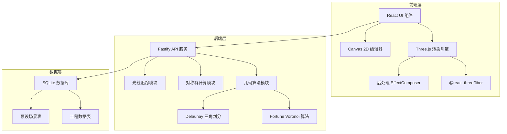
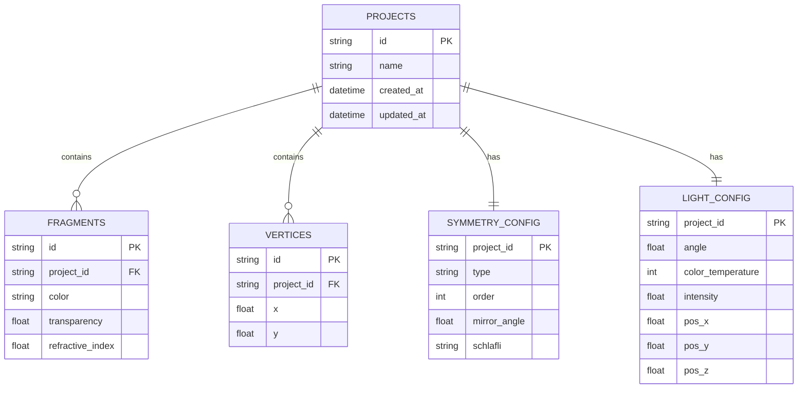

## 1. 架构设计



## 2. 技术描述

- **前端**：React@18 + TypeScript + Vite + TailwindCSS@3 + Three.js + @react-three/fiber + @react-three/drei + @react-three/postprocessing
- **后端**：Fastify@4 + TypeScript
- **数据库**：SQLite + better-sqlite3
- **几何计算**：自定义 Fortune 算法实现 + d3-delaunay

## 3. 目录结构

```
stained-glass-kaleidoscope/
├── client/
│   ├── src/
│   │   ├── components/
│   │   │   ├── Canvas2DEditor.tsx      # 2D玻璃碎片编辑器
│   │   │   ├── Kaleidoscope3D.tsx      # 3D万花筒渲染
│   │   │   ├── ControlPanel.tsx        # 参数控制面板
│   │   │   ├── PresetButtons.tsx       # 预设场景按钮
│   │   │   ├── MaterialEditor.tsx      # 材质编辑器
│   │   │   └── StatusBar.tsx           # 状态栏
│   │   ├── shaders/
│   │   │   ├── glassVertex.glsl        # 玻璃顶点着色器
│   │   │   └── glassFragment.glsl      # 玻璃片元着色器
│   │   ├── stores/
│   │   │   └── kaleidoscopeStore.ts    # Zustand 状态管理
│   │   ├── types/
│   │   │   └── index.ts                # 类型定义
│   │   ├── utils/
│   │   │   ├── symmetry.ts             # 对称群计算工具
│   │   │   └── api.ts                  # API 客户端
│   │   └── App.tsx
│   └── package.json
├── server/
│   ├── src/
│   │   ├── algorithms/
│   │   │   ├── fortune.ts              # Fortune Voronoi 算法
│   │   │   ├── delaunay.ts             # Delaunay 三角剖分
│   │   │   ├── symmetryGroups.ts       # 对称群矩阵计算
│   │   │   └── rayTracing.ts           # 光线追踪
│   │   ├── routes/
│   │   │   ├── geometry.ts             # 几何计算API
│   │   │   ├── projects.ts             # 工程管理API
│   │   │   └── presets.ts              # 预设场景API
│   │   ├── db/
│   │   │   └── database.ts             # SQLite 数据库
│   │   └── index.ts                    # Fastify 服务入口
│   └── package.json
└── package.json
```

## 4. 路由定义

| 路由 | 方法 | 用途 |
|------|------|------|
| / | GET | 主工作台页面 |
| /api/geometry/voronoi | POST | 计算Voronoi图 |
| /api/geometry/delaunay | POST | 计算Delaunay三角剖分 |
| /api/symmetry/matrix | POST | 生成对称群变换矩阵 |
| /api/raytrace | POST | 光线追踪计算 |
| /api/projects | GET | 获取工程列表 |
| /api/projects/:id | GET | 加载指定工程 |
| /api/projects | POST | 保存工程 |
| /api/presets | GET | 获取预设场景列表 |
| /api/presets/:id | GET | 加载指定预设 |

## 5. API 定义

### 5.1 几何计算请求

```typescript
interface VoronoiRequest {
  points: Array<{ x: number; y: number }>;
  bounds: { width: number; height: number };
}

interface VoronoiResponse {
  cells: Array<{
    site: { x: number; y: number };
    vertices: Array<{ x: number; y: number }>;
    neighbors: number[];
  }>;
  edges: Array<{
    start: { x: number; y: number };
    end: { x: number; y: number };
    left: number;
    right: number;
  }>;
}
```

### 5.2 对称群计算

```typescript
interface SymmetryRequest {
  type: 'dihedral' | 'cyclic' | 'spherical' | 'hyperbolic';
  order: number;
  schlafli?: string;
  mirrorAngle: number;
}

interface SymmetryResponse {
  matrices: number[][][];
  generators: number[][][];
  fundamentalDomain: Array<{ x: number; y: number }>;
}
```

### 5.3 工程数据结构

```typescript
interface KaleidoscopeProject {
  id: string;
  name: string;
  createdAt: number;
  updatedAt: number;
  vertices: Array<{ x: number; y: number; id: string }>;
  fragments: Array<{
    id: string;
    vertices: string[];
    color: string;
    transparency: number;
    refractiveIndex: number;
  }>;
  symmetry: SymmetryConfig;
  lightSource: LightConfig;
}

interface SymmetryConfig {
  type: 'dihedral' | 'cyclic' | 'spherical' | 'hyperbolic';
  order: number;
  mirrorAngle: number;
  schlafli?: string;
}

interface LightConfig {
  angle: number;
  colorTemperature: number;
  intensity: number;
  position: { x: number; y: number; z: number };
}
```

## 6. 数据模型

### 6.1 ER 图



### 6.2 DDL 语句

```sql
CREATE TABLE projects (
  id TEXT PRIMARY KEY,
  name TEXT NOT NULL,
  created_at INTEGER NOT NULL,
  updated_at INTEGER NOT NULL
);

CREATE TABLE vertices (
  id TEXT PRIMARY KEY,
  project_id TEXT NOT NULL REFERENCES projects(id) ON DELETE CASCADE,
  x REAL NOT NULL,
  y REAL NOT NULL
);

CREATE TABLE fragments (
  id TEXT PRIMARY KEY,
  project_id TEXT NOT NULL REFERENCES projects(id) ON DELETE CASCADE,
  color TEXT NOT NULL,
  transparency REAL NOT NULL DEFAULT 0.3,
  refractive_index REAL NOT NULL DEFAULT 1.5
);

CREATE TABLE fragment_vertices (
  fragment_id TEXT NOT NULL REFERENCES fragments(id) ON DELETE CASCADE,
  vertex_id TEXT NOT NULL REFERENCES vertices(id) ON DELETE CASCADE,
  position INTEGER NOT NULL,
  PRIMARY KEY (fragment_id, vertex_id, position)
);

CREATE TABLE symmetry_config (
  project_id TEXT PRIMARY KEY REFERENCES projects(id) ON DELETE CASCADE,
  type TEXT NOT NULL DEFAULT 'dihedral',
  order INTEGER NOT NULL DEFAULT 6,
  mirror_angle REAL NOT NULL DEFAULT 60,
  schlafli TEXT
);

CREATE TABLE light_config (
  project_id TEXT PRIMARY KEY REFERENCES projects(id) ON DELETE CASCADE,
  angle REAL NOT NULL DEFAULT 45,
  color_temperature INTEGER NOT NULL DEFAULT 6500,
  intensity REAL NOT NULL DEFAULT 1.0,
  pos_x REAL NOT NULL DEFAULT 0,
  pos_y REAL NOT NULL DEFAULT 2,
  pos_z REAL NOT NULL DEFAULT 5
);

CREATE TABLE presets (
  id TEXT PRIMARY KEY,
  name TEXT NOT NULL,
  description TEXT,
  thumbnail TEXT,
  project_data TEXT NOT NULL
);
```

## 7. 核心算法模块

### 7.1 Fortune Voronoi 算法
- 基于事件驱动的扫描线算法
- 处理海滩线（beach line）的抛物线弧段
- 支持圆事件（circle event）和站点事件（site event）
- 输出 Voronoi 单元和边

### 7.2 对称群计算
- 二面体群 Dn：n次旋转 + n次反射
- 循环群 Cn：n次旋转
- 球面几何：基于 Schläfli 符号的正多面体对称
- 双曲几何：庞加莱圆盘模型的 Möbius 变换

### 7.3 光线追踪
- 多层介质的反射折射计算（菲涅尔方程）
- 全内反射检测
- 最大反射次数限制（性能保护）
- 颜色混合与吸收计算

## 8. 性能优化策略

1. **LOD 系统**：双曲镶嵌在边界处降低细节
2. **WebGL 实例化渲染**：重复对称单元使用 InstancedMesh
3. **Worker 计算**：Voronoi 和对称群计算在 Web Worker 中执行
4. **帧节流**：参数调节时降低渲染质量，释放后恢复
5. **内存池**：复用 Three.js 对象，避免频繁 GC
