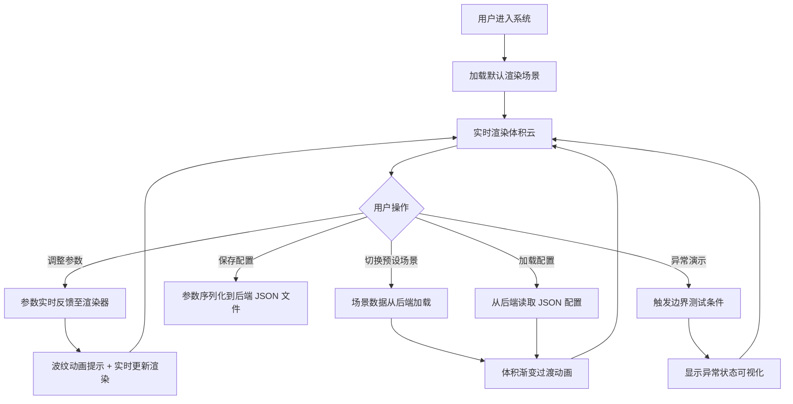

## 1. 产品概述

本项目是一个基于 Vue + Three.js + Compute Shader 前端与 Express 后端的实时体积云渲染系统，旨在展示实时体积云渲染技术的视觉效果和技术挑战。系统提供交互式参数控制、多种预设场景和异常情况演示功能。

- **核心目的**：实现高质量实时体积云渲染，提供沉浸式视觉体验，同时展示 WebGL 技术的边界和异常处理机制
- **目标用户**：图形开发者、技术爱好者、教育机构
- **市场价值**：展示 WebGL 2.0/3.0 计算着色器在体积渲染领域的应用潜力，为相关技术研究提供演示平台

## 2. 核心功能

### 2.1 用户角色

| 角色 | 注册方式 | 核心权限 |
|------|----------|----------|
| 普通用户 | 无需注册，直接访问 | 浏览渲染效果、调整参数、切换预设场景、保存/加载配置 |

### 2.2 功能模块

1. **主渲染页面**：Three.js 体积云渲染画布、实时帧率显示、渲染状态监控
2. **参数控制面板**：云层密度、光照强度、风速、采样精度等参数滑块
3. **预设场景区**：四个预设场景按钮（静态积云、动态风暴云、日出光照、超大体积压力测试）
4. **配置管理区**：保存/加载云层配置、预设场景数据管理
5. **异常演示区**：噪点可视化、帧率崩溃演示、纹理内存限制、优雅降级展示

### 2.3 页面详情

| 页面名称 | 模块名称 | 功能描述 |
|-----------|-------------|---------------------|
| 主渲染页面 | 体积云渲染画布 | 实时渲染体积云效果，支持鼠标交互旋转视角 |
| 主渲染页面 | 性能监控面板 | 显示 FPS、渲染耗时、显存使用等实时数据 |
| 主渲染页面 | 异常状态提示 | 当发生渲染错误、性能下降时显示警告信息 |
| 参数控制面板 | 云层参数滑块 | 密度、厚度、覆盖率等参数实时调整 |
| 参数控制面板 | 光照参数滑块 | 光照强度、散射系数、太阳高度角调整 |
| 参数控制面板 | 动画参数滑块 | 风速、风向、粒子流动速度调整 |
| 参数控制面板 | 高级参数滑块 | 采样步数、噪声精度、渲染分辨率调整 |
| 预设场景区 | 场景切换按钮 | 一键切换四个预设场景，带过渡动画 |
| 配置管理区 | 配置保存/加载 | 本地 JSON 文件存储，支持导入导出 |
| 异常演示区 | 边界测试按钮 | 主动触发各种异常情况用于演示 |

## 3. 核心流程

### 用户操作流程
用户进入系统后，首先看到默认的体积云渲染场景。用户可以通过调整参数面板实时观察云层变化，或点击预设场景按钮快速切换到不同的云层效果。用户可以将满意的参数配置保存到本地，也可以加载已保存的配置。系统会实时显示性能数据，当触发异常情况时（如超大体积压力测试），用户可以观察到帧率下降、噪点增加等现象。

## 4. 用户界面设计

### 4.1 设计风格

**整体风格**：科技感深色主题，强调沉浸感和未来感

- **主色调**：深空蓝 `#0a0e27` 作为背景，配合渐变的天蓝色 `#4a90d9` 和云白色 `#f0f4ff`
- **强调色**：电光紫 `#7b2cbf` 用于按钮和交互元素，琥珀橙 `#ff9500` 用于警告和异常提示
- **字体**：标题使用 `Orbitron` 或 `Rajdhani` 等科技感字体，正文使用 `Inter` 或 `Roboto` 保证可读性
- **按钮风格**：半透明玻璃拟态效果，带有微弱发光边框，hover 时有脉冲动画
- **布局风格**：渲染画布全屏居中，控制面板悬浮于右侧，采用可折叠抽屉式设计
- **图标风格**：线性简洁图标，配合霓虹发光效果

### 4.2 页面设计概述

| 页面名称 | 模块名称 | UI 元素 |
|-----------|-------------|-------------|
| 主渲染页面 | 渲染画布 | 全屏 Three.js Canvas，背景深空渐变，云层体积渲染 |
| 主渲染页面 | 性能监控 | 左上角半透明面板，显示 FPS、Frame Time、Memory，数字使用等宽字体 |
| 主渲染页面 | 状态指示器 | 右上角圆形指示灯，绿色正常/黄色警告/红色错误，带状态文字 |
| 参数控制面板 | 面板容器 | 右侧可折叠抽屉，背景半透明深色，玻璃模糊效果 |
| 参数控制面板 | 参数组 | 分组标题（云层、光照、动画、高级），每组包含多个滑块 |
| 参数控制面板 | 滑块控件 | 自定义样式滑块，轨道发光，滑块带指示值，拖动时有波纹扩散 |
| 预设场景区 | 按钮组 | 四个并排按钮，带有场景缩略图标，选中时有高亮和波纹效果 |
| 配置管理区 | 文件操作 | 保存/加载按钮组，文件选择器，配置列表 |
| 异常演示区 | 测试按钮 | 警告色边框按钮，点击触发对应异常，带有确认弹窗 |

### 4.3 响应性

- **桌面端优先**：1920x1080 及以上分辨率优化，控制面板固定宽度 380px
- **平板适配**：1024px 以下控制面板可完全折叠，通过底部按钮唤出
- **移动端**：768px 以下简化界面，隐藏高级参数，按钮尺寸增大，采用垂直布局

### 4.4 3D 场景指导

**环境与氛围**：
- 背景：深空渐变背景，从地平线的深紫过渡到天顶的深蓝
- HDRI：使用程序化天空渐变，配合真实大气散射效果
- 氛围：添加体积雾和镜头光晕增强沉浸感

**光照设置**：
- 主光源：模拟太阳光，可调节高度角和方位角，支持日出日落效果
- 环境光：基于物理的天空光，随太阳位置动态变化
- 体积光照：实现光线穿透云层的散射效果，可见光束

**相机设置**：
- 默认视角：略高于云层的 45 度俯视角度
- 相机控制：使用 OrbitControls，支持鼠标拖拽旋转、滚轮缩放
- 运动：场景切换时有平滑的相机动画过渡

**构图与焦点**：
- 主体：云层占据画面中心 60% 区域，留有适当天空和地平线
- 层次：前层碎云、中层主云、后层远景云，形成深度感
- 视觉引导：太阳光晕和体积光束引导视线

**交互与动画**：
- 云层流动：根据风速参数实时更新云层位置和形态
- 粒子效果：云层边缘的微小粒子流动扩散动画
- 参数反馈：调整参数时产生从鼠标位置扩散的波纹动画
- 场景过渡：切换场景时云层从当前形态渐变到目标形态

**后期处理**：
- Bloom 效果：增强光源和云层亮部的发光感
- 色调映射：ACES 电影级色调映射
- 颜色分级：根据预设场景调整整体色调
- 景深：可选的景深效果，突出主体云层

**性能预算**：
- 标准场景：目标 60 FPS，渲染分辨率 1024x768
- 压力测试：允许帧率下降至 15 FPS 以下以展示性能边界
- 纹理内存：3D 噪声纹理限制在 256MB 以内
