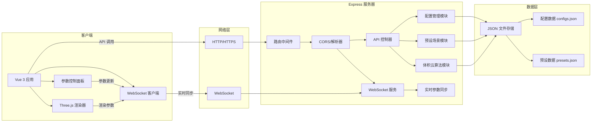
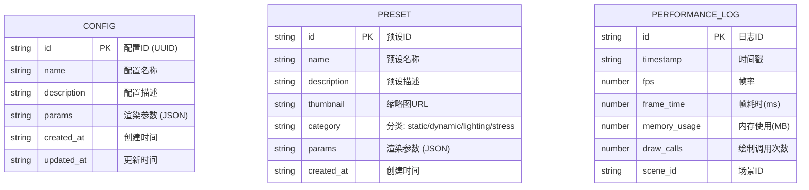

## 1. 架构设计

本系统采用前后端分离架构，前端负责实时渲染和用户交互，后端负责核心算法实现和数据持久化。通过 WebSocket 实现参数实时同步，HTTP API 实现配置管理。


## 2. 技术描述

### 前端技术栈
- **框架**: Vue 3 (Composition API) + TypeScript
- **构建工具**: Vite 5.x
- **3D 渲染**: Three.js r160+
- **计算着色器**: three.js addons (WebGLRenderer + WebGLComputeRenderer)
- **状态管理**: Pinia
- **UI 样式**: SCSS + CSS Variables
- **HTTP 客户端**: Axios
- **WebSocket**: 原生 WebSocket API
- **性能监控**: 自定义 FPS 计数器 + three.js 性能监视器

### 后端技术栈
- **框架**: Express 4.x
- **运行时**: Node.js 18+
- **语言**: JavaScript (ES6+)
- **WebSocket**: ws 库
- **文件操作**: 原生 fs/promises
- **CORS**: cors 中间件
- **数据验证**: Joi

### 核心依赖版本
| 依赖 | 版本 | 用途 |
|------|------|------|
| three | ^0.160.0 | 3D 渲染引擎 |
| vue | ^3.4.0 | 前端框架 |
| pinia | ^2.1.0 | 状态管理 |
| vite | ^5.0.0 | 构建工具 |
| express | ^4.18.0 | 后端框架 |
| ws | ^8.14.0 | WebSocket 通信 |
| cors | ^2.8.5 | 跨域资源共享 |
| joi | ^17.11.0 | 数据验证 |

## 3. 路由定义

### 前端路由
| 路由 | 页面 | 用途 |
|-------|------|---------|
| / | 主页 | 体积云渲染主界面，包含渲染画布、控制面板、预设场景 |

### 后端 API 路由
| 路由 | 方法 | 用途 |
|-------|------|---------|
| /api/configs | GET | 获取所有保存的配置列表 |
| /api/configs/:id | GET | 获取指定配置详情 |
| /api/configs | POST | 保存新的配置 |
| /api/configs/:id | PUT | 更新指定配置 |
| /api/configs/:id | DELETE | 删除指定配置 |
| /api/presets | GET | 获取所有预设场景 |
| /api/presets/:id | GET | 获取指定预设场景详情 |
| /api/cloud/raymarch | POST | 后端光线步进计算（演示用） |
| /api/cloud/noise | POST | 后端噪声函数计算（演示用） |
| /health | GET | 服务器健康检查 |

### WebSocket 实时通信
| 事件 | 方向 | 用途 |
|------|------|---------|
| param-update | 客户端 → 服务端 | 参数更新实时同步 |
| param-broadcast | 服务端 → 客户端 | 参数变更广播 |
| performance-report | 客户端 → 服务端 | 性能数据上报 |
| alert-notification | 服务端 → 客户端 | 异常告警通知 |

## 4. API 定义

### 4.1 配置管理 API

#### 获取配置列表
```typescript
// GET /api/configs
// Response:
interface ConfigListItem {
  id: string;
  name: string;
  description: string;
  createdAt: string;
  updatedAt: string;
  preview?: string;
}

type ConfigListResponse = ConfigListItem[];
```

#### 保存配置
```typescript
// POST /api/configs
// Request:
interface SaveConfigRequest {
  name: string;
  description?: string;
  params: CloudRenderParams;
}

// Response:
interface SaveConfigResponse {
  success: boolean;
  id: string;
  message: string;
}
```

#### 体积云渲染参数类型
```typescript
interface CloudRenderParams {
  // 云层参数
  cloudDensity: number;      // 0.1 - 5.0
  cloudThickness: number;    // 0.5 - 10.0
  cloudCoverage: number;     // 0.0 - 1.0
  cloudHeight: number;       // 500 - 5000
  
  // 光照参数
  lightIntensity: number;    // 0.1 - 5.0
  scatterCoeff: number;      // 0.1 - 2.0
  sunHeight: number;         // 0 - 90 (度)
  sunAzimuth: number;        // 0 - 360 (度)
  
  // 动画参数
  windSpeed: number;         // 0 - 100
  windDirection: number;     // 0 - 360 (度)
  particleSpeed: number;     // 0 - 10
  
  // 高级参数
  sampleCount: number;       // 16 - 256
  noiseResolution: number;   // 32 - 256
  renderScale: number;       // 0.25 - 2.0
  
  // 场景过渡
  transitionProgress?: number; // 0 - 1
}
```

### 4.2 预设场景 API

```typescript
// GET /api/presets
// Response:
interface PresetScene {
  id: string;
  name: string;
  description: string;
  thumbnail: string;
  params: CloudRenderParams;
  category: 'static' | 'dynamic' | 'lighting' | 'stress';
}

type PresetListResponse = PresetScene[];
```

### 4.3 体积云算法 API

```typescript
// POST /api/cloud/raymarch
// Request:
interface RayMarchRequest {
  rayOrigin: [number, number, number];
  rayDir: [number, number, number];
  params: CloudRenderParams;
  maxSteps: number;
}

// Response:
interface RayMarchResponse {
  color: [number, number, number];
  density: number;
  depth: number;
  steps: number;
}

// POST /api/cloud/noise
// Request:
interface NoiseRequest {
  position: [number, number, number];
  octaves: number;
  frequency: number;
  lacunarity: number;
  gain: number;
}

// Response:
interface NoiseResponse {
  value: number;
  fbmValue: number;
  derivatives?: [number, number, number];
}
```

## 5. 服务器架构图



## 6. 数据模型

### 6.1 数据模型定义



### 6.2 数据存储结构

#### configs.json 结构
```json
{
  "version": "1.0.0",
  "lastModified": "2024-01-01T00:00:00.000Z",
  "configs": [
    {
      "id": "uuid-string",
      "name": "我的云层配置",
      "description": "自定义的积云效果",
      "params": {
        "cloudDensity": 1.0,
        "cloudThickness": 3.0,
        "cloudCoverage": 0.6,
        "cloudHeight": 1500,
        "lightIntensity": 1.5,
        "scatterCoeff": 0.8,
        "sunHeight": 45,
        "sunAzimuth": 180,
        "windSpeed": 10,
        "windDirection": 90,
        "particleSpeed": 2,
        "sampleCount": 64,
        "noiseResolution": 128,
        "renderScale": 1.0
      },
      "createdAt": "2024-01-01T00:00:00.000Z",
      "updatedAt": "2024-01-01T00:00:00.000Z"
    }
  ]
}
```

#### presets.json 结构
```json
{
  "version": "1.0.0",
  "presets": [
    {
      "id": "static-cumulus",
      "name": "静态积云",
      "description": "经典的晴天积云场景，适合观察云层细节",
      "thumbnail": "preset1.png",
      "category": "static",
      "params": {
        "cloudDensity": 1.2,
        "cloudThickness": 2.5,
        "cloudCoverage": 0.5,
        "cloudHeight": 1500,
        "lightIntensity": 2.0,
        "scatterCoeff": 0.6,
        "sunHeight": 60,
        "sunAzimuth": 135,
        "windSpeed": 0,
        "windDirection": 0,
        "particleSpeed": 0,
        "sampleCount": 96,
        "noiseResolution": 128,
        "renderScale": 1.0
      },
      "createdAt": "2024-01-01T00:00:00.000Z"
    },
    {
      "id": "dynamic-storm",
      "name": "动态风暴云",
      "description": "快速流动的风暴云层，展现动态效果",
      "thumbnail": "preset2.png",
      "category": "dynamic",
      "params": {
        "cloudDensity": 3.5,
        "cloudThickness": 8.0,
        "cloudCoverage": 0.9,
        "cloudHeight": 2500,
        "lightIntensity": 0.8,
        "scatterCoeff": 1.5,
        "sunHeight": 20,
        "sunAzimuth": 270,
        "windSpeed": 80,
        "windDirection": 180,
        "particleSpeed": 8,
        "sampleCount": 128,
        "noiseResolution": 192,
        "renderScale": 0.75
      },
      "createdAt": "2024-01-01T00:00:00.000Z"
    },
    {
      "id": "sunrise-lighting",
      "name": "日出光照效果",
      "description": "温暖的日出光线穿透云层的散射效果",
      "thumbnail": "preset3.png",
      "category": "lighting",
      "params": {
        "cloudDensity": 1.8,
        "cloudThickness": 3.5,
        "cloudCoverage": 0.7,
        "cloudHeight": 1800,
        "lightIntensity": 3.0,
        "scatterCoeff": 1.2,
        "sunHeight": 8,
        "sunAzimuth": 90,
        "windSpeed": 15,
        "windDirection": 45,
        "particleSpeed": 1.5,
        "sampleCount": 96,
        "noiseResolution": 128,
        "renderScale": 1.0
      },
      "createdAt": "2024-01-01T00:00:00.000Z"
    },
    {
      "id": "stress-test",
      "name": "超大体积压力测试",
      "description": "极限参数测试系统性能边界",
      "thumbnail": "preset4.png",
      "category": "stress",
      "params": {
        "cloudDensity": 5.0,
        "cloudThickness": 10.0,
        "cloudCoverage": 1.0,
        "cloudHeight": 5000,
        "lightIntensity": 1.0,
        "scatterCoeff": 2.0,
        "sunHeight": 45,
        "sunAzimuth": 180,
        "windSpeed": 50,
        "windDirection": 0,
        "particleSpeed": 5,
        "sampleCount": 256,
        "noiseResolution": 256,
        "renderScale": 2.0
      },
      "createdAt": "2024-01-01T00:00:00.000Z"
    }
  ]
}
```
